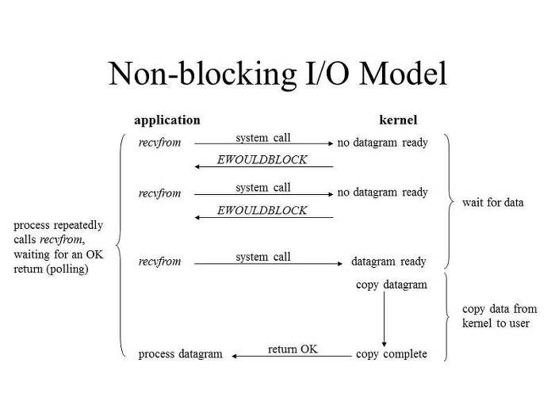

# Non-Blocking Server

블로킹 모드의 소켓은 read, write, accept 메서드 등과 같은 입출력 메서드가 호출되면 처리가 완료될 때까지 스레드가 멈추게 되어 다른 처리를 할 수 없었다.

이와 같은 단점을 해결하는 방식이 논블로킹 소켓이다.

예를 들어 논블로킹 모드의 소켓에서 데이터를 읽는 명령인 read 메서드를 호출했다고 가정하면, 이 read 메서드의 처리 결과는 소켓에서 읽어들인 바이트 길이다.

만약 클라이언트가 데이터를 아직 전송하지 않았거나 데이터가 수신버퍼까지 도달하지 않았다면 read 메서드는 읽어들인 바이트 길이인 0을 돌려준다.


논블로킹 소켓은 구조적으로 소켓으로부터 읽은 데이터를 바로 소켓에 쓸 수가 없다.

이를 위해서 각 이벤트가 공유하는 데이터 객체를 생성하고 그 객체를 통해서 각 소켓 채널로 데이터를 전송한다.


###### 소스에 대한 설명

```
자바 NIO 컴포넌트 중의 하나인 Selector는 자신에게 등록된 채널에 변경 사항이 발생했는지 검사하고 변경 사항이 발생한 채널에 대한 접근을 가능하게 해준다.

블로킹 소켓의 ServerSocket에 대응되는 논블로킹 소켓의 서버 소켓 채널을 생성한다.

블로킹 소켓과 다르게 소켓 채널을 먼저 생성하고 사용할 포트를 바인딩한다.

생성한 Selector와 ServerSocketChannel 객체가 정상적으로 생성되었는지 확인한다.

소켓 채널의 블로킹 모드의 기본값은 true로, 별도로 논블로킹 모드로 지정하지 않으면 블로킹 모드로 동작한다.

클라이언트의 연결을 대기할 포트를 지정하고 생성된 ServerSocketChannel 객체에 할당한다.

이 작업이 완료되면 ServerSocketChannel 객체가 지정된 포트로부터 클라이언트의 연결을 생성할 수 있다.

Selector에 등록된 채널에서 변경 사항이 발생했는지 검사한다.
Selector에 아무런 I/O 이벤트도 발생하지 않으면 스레드는 이 부분에서 블로킹된다.
I/O 이벤트가 발생하지 않았을 때 블로킹을 피하고 싶다면 selectNow 메서드를 사용하면 된다.

I/O 이벤트가 발생한 채널에서 동일한 이벤트가 감지되는 것을 방지하기 위하여 조회된 목록에서 제거한다.

조회된 I/O 이벤트 종류에 따라 이벤트를 처리한다.

연결 요청 이벤트가 발생한 채널은 항상 ServerSocketChannel이므로 이벤트가 발생한 채널을 ServerSocketChannel로 캐스팅한다.

ServerSocketChannel을 사용하여 클라이언트의 연결을 수락하고 연결된 소켓 채널을 가져온다.

연결된 클라이언트 소켓 채널을 논블로킹 모드로 설정한다.

클라이언트 소켓 채널을 Selector에 등록하여 I/O 이벤트를 감시한다.
```


블로킹 소켓과 논블로킹 방식의 가장 큰 차이점은 I/O 처리 방법에 있다.


소켓 동작 방식이 다르므로 입출력을 위한 메서드 및 프로그램 호출 구조가 다르다.



<http://www.masterraghu.com/subjects/np/introduction/unix_network_programming_v1.3/ch06lev1sec2.html>

